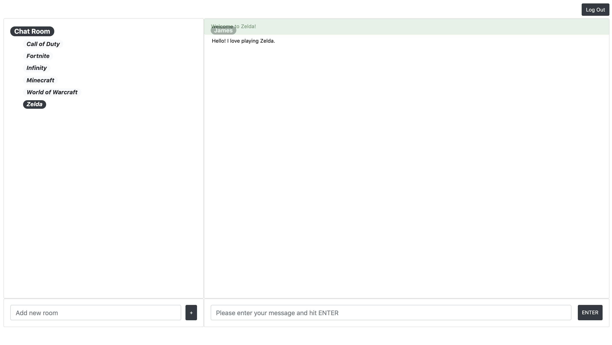

# Chat App


<br/>
<br/>
<br/>
<br/>
<br/>
<p>This project was developed with Chatkit SDK/API, Express, React and MongoDB Atlas. This is a simple text chat app that user can sign up, log in and subscribe to a chat room to discuss their favorite video games. Chat rooms are sorted in ascendant order for users' convenience. Once enter a room, a welcome message will popup to welcome the user and 100 recent messages will be retrieved. Users can also create their own chat rooms. A message will popup and prevent user to create a chat room that already exists. When user is at the most recent chat message, window will auto scroll if new messages come in and remain still if user is reading chat history and away from most recent message.<p>


## Get Started

To get up and running with this project, run the following commands from the chat_app root directory.

1. Install the project's dependencies using npm.

```
npm install
```
2. Create a .env file with the following environment variables and replace the value with your own Chatkit key, Chatkit instance locator and MongoDB connection string.

```
KEY=YOUR_CHATKIT_KEY
INSTANCE_LOCATOR=YOUR_CHATKIT_INSTANCE_LOCATOR
DB_URL=YOUR_MONGODB_CONNETION_STRING
```
3. Start the server
```
npm start
```
4. To test the Express server, browse to the URL http://localhost:5000/.

Then run the following commands from the client folder.

1. Install the project's dependencies using npm.
```
npm install
```
2. Create a config.js file in src directory with following variables.
```
const instanceLocator = YOUR_CHATKIT_INSTANCE_LOCATOR
```
3. Start the application
```
npm start
```
4. Browse to the URL http://localhost:3000/.
